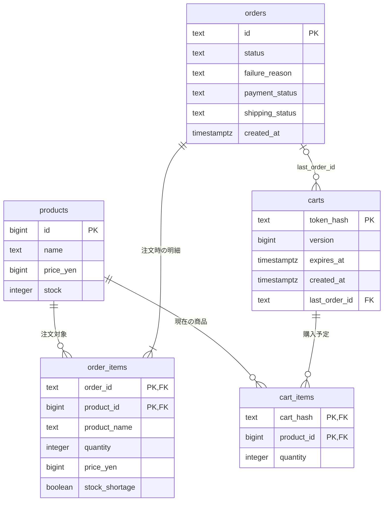

# カートと注文のER図

- `products.stock`が商品単位の残在庫。カート追加では減らさず、成功注文でだけ減らします。
- `cart_items`は同じカート・商品につき1行。現在価格を商品から読みます。
- `orders`が注文全体の決済・配送状態、`order_items`が当時の名称・価格・数量を保持します。合計は明細から計算します。
- 失敗注文にも全明細を残し、在庫不足明細は`stock_shortage`で示します。
- 外部の決済・配送テーブルはありません。模擬状態を同じDBトランザクション内で扱います。
- 注文に最低1明細を保存することはアプリのトランザクションで保証します。

ロック順は「カート → 商品ID昇順」。単品互換APIも同じ商品ロック・注文保存処理を利用します。
