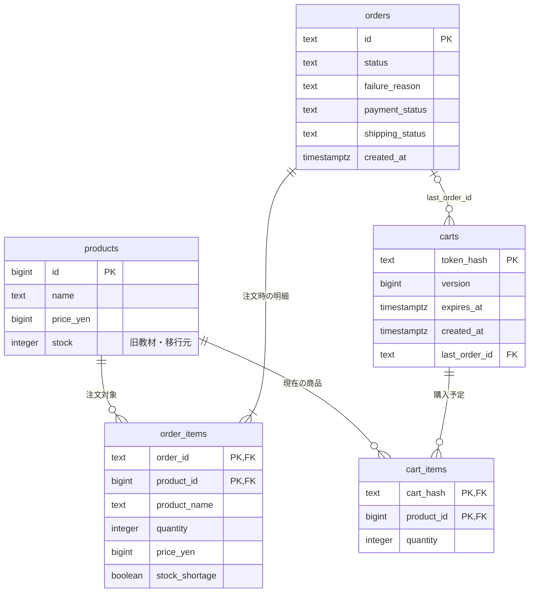

# カートと注文のER図

- `products.stock`は移行元・旧教材用です。現行の販売可能数は別DBの`stocks.available`で、Inventoryが予約時に減らし、解除時に一度だけ戻します。
- `cart_items`は同じカート・商品につき1行。現在価格を商品から読みます。
- `orders`が注文全体の決済・配送状態、`order_items`が当時の名称・価格・数量を保持します。合計は明細から計算します。
- 失敗注文にも全明細を残し、在庫不足明細は`stock_shortage`で示します。
- Paymentの`payments`とShippingの`shipments`はそれぞれ専用DBに保存します。`order_id`で関連付けますが、DB間の外部キーはありません。
- 注文に最低1明細を保存することはアプリのトランザクションで保証します。

ロック順は「カート → 商品ID昇順」。単品互換APIも同じ商品ロック・注文保存処理を利用します。

`order_progress`は注文ごとの模擬モード・在庫予約保持・カート識別を保存します。`carts.pending_order_id`は結果不明の二重購入を防ぎます。
Shippingの明細は`shipments.items`（商品ID・数量のJSON配列）に保存し、商品DBへの参照は行いません。詳細は[Shipping学習手順](learning3-shipping.md)を参照してください。

## 学習3 Inventory分離後

現行フローと図は[Inventoryの設計](learning3-inventory.md)を参照。
商品名・価格・注文明細はOrder、販売可能数`stocks.available`と予約`reservations`はInventoryの別DBが所有する。
`products.stock`は移行元・旧教材用に残るが、現行アプリの在庫の正ではない。
`orders.inventory_status`が表示用状態、`order_progress.phase`が再開段階、`failure_reason`が補償後に確定する理由を保持する。
`stock_held`は進行の補助情報で、Orderから数量を直接増減させない。
移行済みマーカー`inventory_cutover`（Order側）と`inventory_import`（Inventory側）が移行データの指紋を共有する。
Inventoryの予約はorder_idが主キー、itemsは商品ID・数量の正規化JSON、statusはreserved/rejected/committed/released。
他サービスのDBへの外部キーは持たない。確定では販売可能数を変えず、解除で一度だけ戻す。
