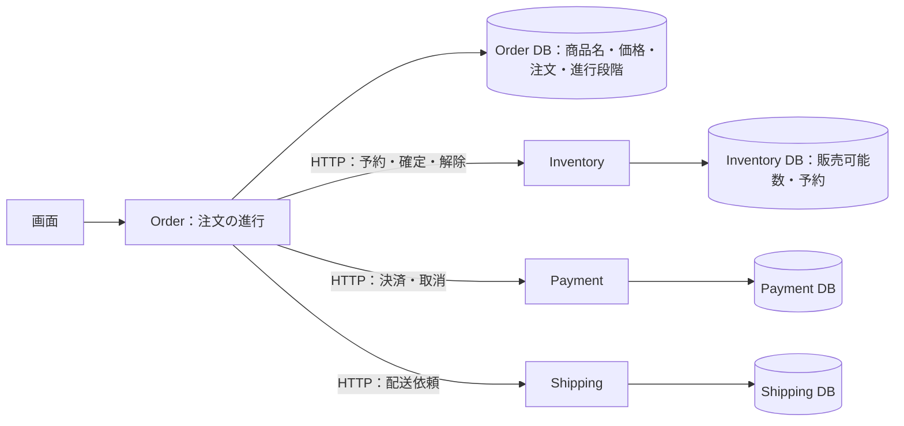
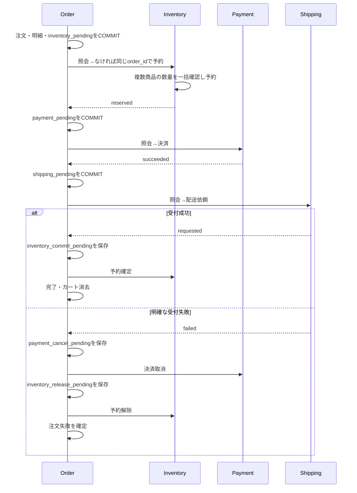

# 学習3：Inventoryを独立させる

## 何を学ぶか

在庫をOrderと同じDBに置くと、「注文保存と在庫予約」を一つのトランザクションにできる。
今回は在庫の責任を独立させ、**二つのDBを一度にCOMMITできなくなったときの復旧設計**を学ぶ。
現在の規模で運用上必須の分離という判断ではない。



各サービスは別Goモジュール・Dockerイメージ・プロセスでビルド／起動する。
Orderは`http://inventory:8080`へ接続する。同じComposeの通信ネットワーク上でもHTTP通信は失敗し得る。
Inventory DBは内部ネットワークで分離し、通常のOrderプロセスには接続情報を渡さない。
移行専用コマンドだけが両DBへ接続する。

## 正常時と失敗時



決済が明確に失敗した場合は配送を呼ばず予約を解除する。在庫不足なら決済も呼ばない。
HTTP中はOrderのDBトランザクションや接続を保持しない。
各通信は最大1秒で、注文要求全体にも既存のタイムアウトがある。

通信断では「失敗」や「在庫ゼロ」と断定しない。注文と次の処理段階をDBに残して503を返す。
画面から同じ注文を「処理を再開」すると保存済みの段階から進む。
例えば予約が保存された直後に応答が消えても、同じ注文IDで照会・再要求するので二重予約しない。
確定済みなのにOrder更新が失敗した場合も、再確定は同じ結果を返す。
複数の再開が競合しても、Orderは保存した段階が一致する場合だけ次へ進み、Inventoryは予約をロックする。

自動再開・予約期限・自動解放はまだない。未処理の注文は手動再開するまで残る。
特に決済／配送の結果不明時に時間だけで解放すると、売れている商品を再販売する危険がある。
学習4以降でワーカー・再試行・監視・補償の運用を扱う。

## 数量とIDの意味

在庫10個から3個を予約すると、販売可能数は7個になる。予約確定では7個のまま、解除すると10個へ戻る。
「現在倉庫にある物理的個数」と「販売可能数」を分けた高度な在庫台帳は今回の対象外。

|操作|API|再実行時|
|---|---|---|
|数量照会|`GET /stocks?ids=1,2`|販売可能数を返す|
|予約|`POST /reservations`（orderId・items）|同一内容は現在の予約、内容不一致は409|
|予約照会|`GET /reservations/{orderId}`|記録なしは404|
|確定|`POST /reservations/{orderId}/commit`（空body）|確定済みなら同じ結果|
|解除|`POST /reservations/{orderId}/release`（空body）|解除済みなら同じ結果|

一注文一予約として`order_id`を予約の主キーにする。別DBの注文テーブルへの外部キーはない。
共通のDBトランザクションIDではなく、業務上同じ処理を識別するIDである。
`request_id`は個々のHTTP要求、`trace_id`はサービスをまたぐ一連の呼び出しを識別する。
再開は新しいtrace_idでも同じorder_id。予約内容は商品ID順に正規化して比較する。

在庫不足の`rejected`も保存し、後から在庫が増えても同じ注文で予約へ復活させない。
再購入は新しい注文として行う。確定と解除が競合した場合は一方だけ成功し、反対の操作は409になる。

商品名と価格は引き続きOrderが所有する。商品／カート画面はInventoryへ数量を一括照会する。
照会できなければ`stockKnown=false`を返し、画面は「在庫確認不可」と表示する。
このときJSONのstock値を確定した数量として扱わない。カートの編集自体は保存できる。

## 既存データの移行

**既存環境の更新は旧Orderを停止してから行う。新旧Orderの混在運用は対象外。**

```sh
# 対象環境のCOMPOSE_PROJECT_NAME等を設定したうえで実行する。
docker compose stop api web
docker compose up --build --wait --wait-timeout 120
```

起動順はOrder DB migration → `inventory-import` → Inventory → Order。
`products.stock`の値はすでに予約分を引いた販売可能数なので、そのまま転記する。
保留注文の明細は`reserved`予約として転記するが、数量をもう一度引かない。
移行済みマーカーと入力の指紋を保存し、移行の再実行で新しいInventoryの数量を上書きしない。
途中停止時の再実行は同じ入力に限り許容し、不整合な状態や異なる移行先は拒否する。
旧`products.stock`列は過去の教材・移行元として残るが、新アプリは数量の取得・更新に使わない。
移行後のダウングレードには別途データ移行が必要になる。

## デモ

通常DBから分けた環境を使う。デモは在庫を消費する。

```sh
export COMPOSE_PROJECT_NAME=ec-inventory-demo
export WEB_PORT=3004 PAYMENT_PORT=8087 SHIPPING_PORT=8088 INVENTORY_PORT=8089 JAEGER_PORT=16689
docker compose up --build --wait --wait-timeout 120
BASE_URL=http://127.0.0.1:3004 INVENTORY_BASE_URL=http://127.0.0.1:8089 JAEGER_URL=http://127.0.0.1:16689 python3 scripts/inventory_demo.py --lifecycle
```

1. 正常注文：予約→決済→配送→予約確定と、在庫が一度だけ減ることを確認する。
2. 決済失敗／配送失敗：予約が解除される。配送失敗では決済取消も入る。
3. Inventory停止：商品一覧は在庫確認不可。注文は決済未開始・在庫確認待ちになる。
4. Orderを再起動、Inventoryを復旧、同じ注文IDで再開：注文が完了する。
5. Inventory／DBの再起動と移行の再実行で、予約と数量が保たれる。
6. 出力されたJaegerリンクを開き、Order・Inventory・Payment・Shippingの親子関係を読む。
   ログを個別に探さず、どのサービスのどの操作で時間がかかったか分かる。

画面で体験するには、Inventoryだけ停止→画面から注文→注文詳細を開く→Inventory復旧→「処理を再開」。
`docker compose stop inventory`と`docker compose up -d --wait inventory`を使う。
ログはJSON標準出力、トレースはOpenTelemetryの非同期バッチでJaegerへ送る。業務HTTP自体は同期のまま。

## 検証コマンド

```sh
COMPOSE_PROJECT_NAME=ec-inventory-test docker compose --profile test run --build --rm inventory-test
COMPOSE_PROJECT_NAME=ec-inventory-test docker compose --profile test run --build --rm api-test
```

実PostgreSQLを使い、複数商品の原子性、最後の1個への並行予約、同一注文の並行再送、確定／解除競合、移行を検証する。
Order統合では実Inventory経由で保存後の応答喪失・解除不能・Order更新失敗を再現し、8並列再開での二重減算／二重返却を検証する。
