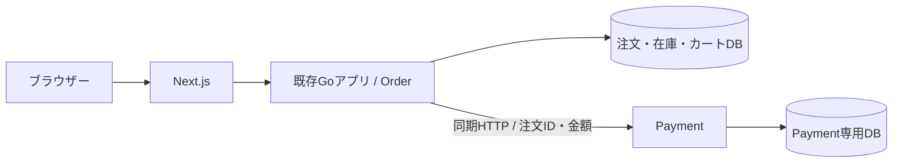
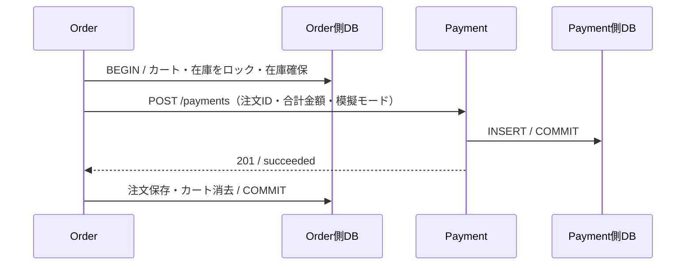
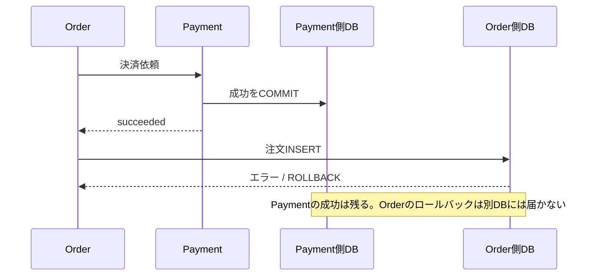

# 学習3・第2単位：OrderからPaymentを同期HTTPで呼ぶ

> このページは第2単位時点の比較用記録です。現在の実装は[第3単位：注文の手動復旧](learning3-order-recovery.md)へ進んでおり、通信中のDBロック保持・結果不明時のロールバックは解消しています。旧手順の結果や検証件数は当時のものです。


[Issue #4](https://github.com/tokatu4561/ec-microservice/issues/4)の第2単位です。
[Payment単体](learning3-payment.md)に続き、Next.jsからのカート注文・旧単品APIを実Paymentへ接続しました。
今回の目的は、別々に動くサービスが依存するようになることと、DBトランザクションの境界を理解することです。
OpenTelemetry、障害実験の詳しい実演、自動復旧・Sagaは後続の単位です。

## 今の構成



Orderの`PAYMENT_BASE_URL`はComposeで`http://payment:8080`を指定します。
両サービスが所属するdefaultネットワークの内部DNSがサービス名を解決します。
MacからPaymentへは`http://127.0.0.1:8081`で接続します。
接続先設定の欠落・不正は起動エラーです。旧模擬決済へのフォールバックはありません。

PaymentとOrderのGoモジュール・Dockerイメージは別です。
`docker compose up --build -d --wait payment`でPaymentだけを更新できます。
Compose全体とCIワークフローは共通で、本番用の独立デプロイパイプラインはまだありません。

## 正常な注文をコードで追う

1. `backend/http.go`または`backend/cart_http.go`で注文IDを発行する。
2. `backend/orders.go`の`CreateOrder`または`backend/cart.go`の`Checkout`でOrder側DBのトランザクションを開始する。
3. カート・商品をロックし、Order側の商品価格から合計金額を決める。在庫不足ならPaymentを呼ばない。
4. `createOrderWithPaymentTx`で在庫を確保し、`backend/payment.go`から`POST /payments`を呼ぶ。
5. Paymentは専用DBへ決済結果をコミットして返す。Orderは注文ID・金額・状態を検証する。
6. 模擬配送が成功したら、Order側DBに注文・明細を保存し、カートを空にしてコミットする。



**OrderのBEGINとCOMMITの間で通信します。** Paymentが遅い間も在庫・カートのロックを保持します。
既存モノリスとの差を小さくして比較する学習用の構成で、長いロック保持を推奨するものではありません。
注文を先に保存して通信前後でトランザクションを分ける案は、途中状態と復旧の管理を扱う段階で比較します。

## 業務失敗と結果不明を分ける

| 発生したこと | HTTP / Order側 | Payment側 |
| --- | --- | --- |
| 正常 | 201、配送依頼済み。在庫を減らしカートを空にする | succeeded |
| 在庫不足 | 201、失敗注文。在庫・カートを維持 | 呼ばない |
| 決済が明確に失敗 | 201、payment_failed。在庫・カートを維持 | failed |
| 配送失敗・取消成功 | 201、shipping_failed。在庫・カートを維持 | cancelled |
| Payment停止・タイムアウト・不正応答 | 503と注文ID。Order側はロールバックを試みる | 未保存か保存済みか、照合が必要 |
| 決済成功後の注文INSERT失敗 | 503と注文ID。注文・在庫・カートはロールバック | succeededが残る |
| 配送失敗後の取消通信失敗 | 503と注文ID。Order側はロールバックを試みる | succeededまたはcancelled等、照合が必要 |

明確な業務失敗のカートは明細を保持し、従来どおりversionを進め、lastOrderIdを保存します。
DBロールバックが完了した結果不明ケースでは、version・lastOrderIdも元に戻ります。
Order側のCOMMIT応答が失われた場合は、Order側も保存済みか不明となるため両方を照合します。



DBエラーで自動的にPaymentを取り消す仕組みはありません。
取消APIを使うのは「決済成功を確認し、その後の模擬配送が明確に失敗した」場合だけです。
その取消も、新しいHTTP要求・別トランザクションです。
Order保存の結果が不明なまま取消すると、成立済み注文の決済を取り消す可能性があるため、無条件の補償を加えません。
プロセス停止後の復旧、要対応状態の永続化、冪等性はまだ扱っていません。

## 通信の契約と期限

- `POST /payments`：Orderが`orderId, amountYen, mode`を送り、201と`succeeded`または`failed`を受け取る。
- `POST /payments/{orderId}/cancel`：本文なし。200と`cancelled`を確認する。
- 成功応答でも注文ID・金額が違う、JSONが不正、状態が不正なら結果不明として503を返す。
- Payment側の409・404・503なども、Orderの「決済失敗」と決めつけず、結果不明として503を返す。
- HTTP要求1回の期限は1秒で、応答本文の読み取りも含む。親の注文処理の期限は従来どおり3秒で、親のキャンセルも伝わる。
- 自動再試行・リダイレクト追従はしない。HTTPをやり直して成功に見せる処理もない。

ブラウザーには注文IDと問い合わせ用IDを返し、注文が見つからなくても未決済とは限らないと表示します。
通信そのものが途切れて応答を受け取れない場合は、IDも取得できない場合があります。
注文結果の404だけで再注文せず、Paymentとログを合わせて調べます。

## 画面から試す

```sh
docker compose up --build --wait --wait-timeout 120
```

1. `http://localhost:3000`で商品をカートに追加し、決済・配送を成功にして注文する。
2. 画面の注文IDを控える。同じIDでPaymentを照会する。
3. 別の注文で「決済失敗」「配送失敗」を選び、失敗と取消済みの違いを確認する。

```sh
# ORDER_IDには画面に出た注文IDを設定する
ORDER_ID=画面の注文ID
curl "http://localhost:3000/api/orders/$ORDER_ID"
curl "http://127.0.0.1:8081/payments/$ORDER_ID"
docker compose logs --no-color api payment | rg "$ORDER_ID"
```

Paymentの`order_id`は、Orderが発行した番号を「どの注文の決済か」の参照として保持します。
同じ番号を使っていてもDBトランザクションは共有しません。
サービス間の外部キーもありません。今回の1注文1決済記録の制約は維持しています。
既存の学習1・2の注文をPaymentへ移行する処理はないため、連携開始前の注文には対応するPayment記録はありません。

## ログで追う

Orderは受信要求のrequest_idを発行し、Paymentへの`X-Request-ID`へ設定します。
Paymentはそれを引き継ぐので、createと必要時のcancelを同じrequest_id・order_idで追えます。
両サービスのHTTPログと、Orderの`payment_call_finished`にサービス名・ID・結果が残ります。
通信結果不明の`result: unknown`は、「Payment側で未保存」を意味しません。

OpenTelemetryのtrace_id・span_id・標準traceparent伝播は次の単位です。
現在は業務IDと要求IDによる相関ログであり、標準的な分散トレーシングを実装済みとは扱いません。

## 検証

```sh
# Orderの単体DBテストと、別DBを持つ実Paymentへの連携・故障注入テスト
docker compose --profile test run --build --rm api-test
# Payment単体
docker compose --profile test run --build --rm payment-test
# TypeScript・ESLint・本番ビルド
docker compose build web
# 既存カートの回帰
python3 scripts/smoke.py
# OrderとPaymentを実HTTPで照合する（成功注文で在庫が減る）
python3 scripts/order_payment_smoke.py
# Payment停止も含める。終了時にPaymentを復旧する
python3 scripts/order_payment_smoke.py --lifecycle
```

`api-test`は一時Order DBと、一時Payment DBを使う`payment-test-server`へ接続します。
既存のOrder DBテストはテスト専用の模擬依存を注入して維持し、新しい連携テストは実サービスを使用します。
模擬依存は`*_test.go`だけに置き、通常バイナリに含めません。
学習2のk6・SQL比較もその模擬依存を使うため、モノリスのSQL比較として維持され、今回のサービス間通信性能を示すものではありません。

単品・カートそれぞれで正常、決済失敗、配送失敗、在庫不足、取消通信失敗、決済保存後の応答喪失、
保存後の不正応答、注文INSERT失敗、接続不可を確認します。
故障注入はテスト内のHTTPプロキシとDBトリガーだけで行い、通常アプリに故障用APIを追加しません。
期限のテストはヘッダー待ち・本文待ち・親キャンセルを分け、自動再送がないことも確認します。

今回の実HTTP検証は通常データと別の`ec-learning3-link-verify`プロジェクト、WEB_PORT=3002、PAYMENT_PORT=8082で実施します。
スクリプトの接続先は`BASE_URL`・`PAYMENT_BASE_URL`で変更できます。ライフサイクル操作を行う場合は、
`COMPOSE_PROJECT_NAME`・`WEB_PORT`・`PAYMENT_PORT`も同じ対象に設定してください。

## この単位の確認ポイント

- Payment停止中、商品一覧は読めても新しい購入は成立しなくなったのはなぜか。
- 決済成功後に注文INSERTが失敗すると、なぜPaymentの成功だけが残るのか。
- 同じ注文ID・request_idを使うことと、同じトランザクションであることは何が違うか。
- 通信中に在庫ロックを持ち続けることで、他の注文へ何が波及するか。

次はOpenTelemetryによるトレースとログの関連付けを計画し、その後に図・ログ・トレースを使って障害実験を行います。
