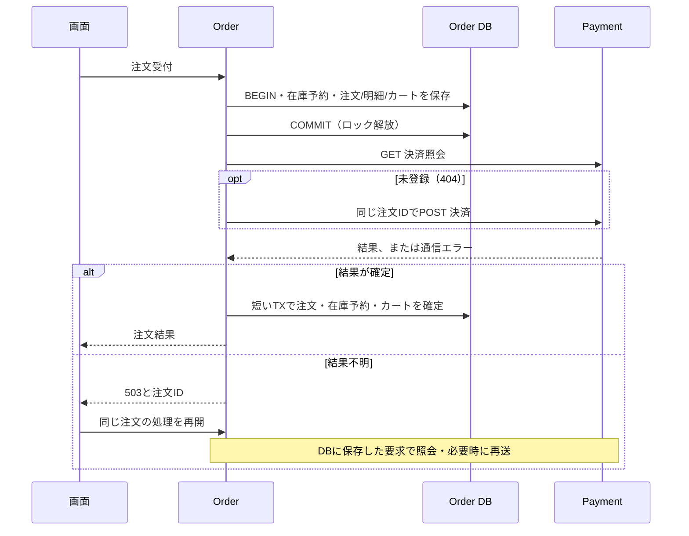

# 学習3・第3単位：短いトランザクションと注文の手動復旧

> この文書はInventory分離前の学習段階を説明します。現在の構成・移行・復旧手順は[Inventory分離](learning3-inventory.md)を参照してください。

Issue: https://github.com/tokatu4561/ec-microservice/issues/4

このページは第3単位の記録です。現在は[第4単位：分散トレーシング](learning3-tracing.md)でOpenTelemetryを追加しています。注文・手動復旧の方式は維持しています。

## 目的と判断

前単位はPaymentの応答待ち中に商品・カートの行ロックを保持し、Orderの保存失敗時にはPaymentだけ残ることがありました。
今回は短いローカルトランザクションを通信の前後に置き、途中状態を永続化します。
同期HTTPのままであり、キューは不要です。全体を一括ロールバックする仕組みではありません。



## 状態と在庫

- `processing`: 注文・明細・価格・要求モードを保存済み。Payment未実行、実行中、または結果未確認。
- `cancel_pending`: 決済成功と模擬配送失敗を確認し、取消の確認待ち。
- `shipping_requested`: 成功の終端状態。配送は模擬処理であり、配送会社へは送信していない。
- `failed`: 在庫不足・明確な決済失敗・決済取消済みの配送失敗。

`products.stock`は販売可能数として扱います。予約時に減らし、`order_progress.stock_held`と注文明細で予約の根拠を保持します。
成功時は減らした在庫をそのまま販売済みとして確定し、失敗時だけ戻します。
別の在庫台帳・物理在庫数は追加していません。時間だけで予約を解除すると、決済成功か不明なのに再販売できてしまうため、自動期限切れはありません。
その不利益として、手動復旧まで販売可能な在庫が減ったままになります。

カートは受付時に版を1つ進め、`lastOrderId`と`pendingOrderId`へ同じIDを保存します。
結果不明なら再読込後も編集・再注文を禁止します。成功時は商品を消去、失敗時は商品を保持し、どちらも処理中の関連付けを解除します。
在庫不足の場合は予約なしの失敗注文を保存します。

## 冪等性と並行再開

PaymentのPOSTは、注文ID・金額・モードが同一なら同じ記録の現在の状態を201で返します。
金額またはモードが異なる場合は409です。取消済みの記録は復活させず、再POSTも`cancelled`を返します。
HTTP 201だけで新規決済と判断せず、返された状態を確認します。取消も繰り返し可能です。
GETの404の後に遅延した元のPOSTが完了しても、再POSTは同じ主キーの記録に収束します。

OrderはHTTPを待っている間、DB接続・行ロックを保持しません。
最後の短いトランザクションで注文行をロックし、すでに終端なら在庫・カートを再操作しません。
これにより、並行再開でも在庫を二度戻しません。配送の成否モードは注文時に保存した値を使用し、再開時には変更できません。
在庫解除が必要な場合、注文→カート→商品ID昇順でロックします。受付はカート→商品ID昇順です。
同じカートの新規受付は処理中判定で拒否され、既存注文のロックを取りに行きません。

## APIと画面

注文詳細の「処理を再開」を使います。GETでの照会自体には副作用がありません。

```sh
curl -X POST http://localhost:3000/api/orders/ORDER_ID/resume \
  -H 'Content-Type: application/json' -H 'X-Cart-Request: 1' -d '{}'
```

- 成功は200 `{order}`。確定済みならその結果だけ返す。
- 注文なしは404。不正なID・本文・ヘッダーは400。
- 通信・確定処理のエラーは503。注文IDで再照会し、接続復旧後に再開する。
- HTTP呼び出しは各1秒、1リクエストのOrder処理は3秒。自動の再試行ループはない。
- 手動再開はGET照会後、必要なら同じPOST・取消を行う。
- 注文IDはローカル学習環境の照会・再開用識別子。ユーザー認証・本番向け権限制御は未実装。

## 検証方法

```sh
docker compose --profile test run --build --rm api-test
docker compose --profile test run --build --rm payment-test
docker compose up --build --wait --wait-timeout 120
python3 scripts/smoke.py
python3 scripts/order_payment_smoke.py --lifecycle
```

`api-test`は実Paymentと専用DBを使用します。単品・カートそれぞれについて、正常・明確失敗・在庫不足、
応答消失、JSON破損、取消停止、取消応答消失、予約保存失敗、注文確定失敗、Payment停止を確認します。
結果不明後に新しいstore/HTTP clientから8件並行再開し、最終状態・在庫・カートを照合します。
HTTPをテスト用ゲートで止めた状態で、Orderの接続プールが1本でも別注文が同じ商品の残数を購入できることを確認します。
`--lifecycle`は検証環境のPaymentを停止し、注文・予約保持を確認してOrderを再起動し、Payment復旧後に同じ注文を再開します。

## 残る課題

自動復旧ワーカー、予約期限の運用、OpenTelemetry、実配送・実決済、Outboxは未実装です。
処理中注文の全件管理画面や監視もありません。保存した注文ID、カート、相関ログで確認します。
単品APIへ別の新規注文を送る操作や、別カートからの購入をまとめて同一操作とみなす冪等性キーはありません。
カートCookie自体が失効・消去された場合の所有者復旧機能も未実装です。注文IDを保持して照会・再開します。
前単位で作った「Paymentだけ残る実験データ」は移行しません。新しい受付から適用する設計です。
