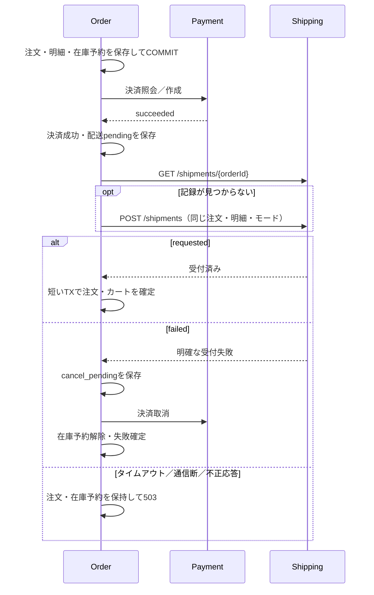

# 学習3：Shippingを独立サービスにする

> この文書はInventory分離前の学習段階を説明します。現在の構成・移行・復旧手順は[Inventory分離](learning3-inventory.md)を参照してください。

## 学ぶこと

Orderは注文全体の進行、Paymentは模擬決済、Shippingは模擬配送依頼の受付を担当する。
InventoryはまだOrder内にある。配送依頼の受付成功は、出荷や配達の完了を意味しない。
今回の対象は同期HTTP、専用DB、結果不明からの手動再開。Queue・自動復旧・実配送連携は学習4以降の対象。



## APIとデータ所有

- Shippingは`shipping/`のGoモジュールとして独立ビルド。Composeの`shipping`と`shipping-db`を個別起動する。
- Orderは`SHIPPING_BASE_URL=http://shipping:8080`へ同期HTTPで通信する。一回最大1秒、Order要求全体は従来の3秒。HTTP中にOrderのDB接続・トランザクションを保持しない。
- ShippingのPostgreSQLだけが`shipments`を所有する。Orderの注文テーブルや商品テーブルへの外部キーはない。
- `order_id`を主キーとする一注文一配送の教材。明細（商品ID・数量）と模擬モードも保存し、JSON応答で照合する。価格・住所・決済情報は送らない。
- `POST /shipments`に`orderId`、`items: [{productId, quantity}]`、`mode: success|fail`を渡す。商品ID順に正規化して比較し、同一内容は現在の記録と201を返す。異なる内容は409。
- `GET /shipments/{orderId}`で照会。404だけでは遅延中の旧要求が未処理とは断定しない。同じ内容のPOSTが安全である契約と組み合わせる。
- `POST /shipments/{orderId}/cancel`は空body。`requested`から`cancelled`へ移行し、再取消は日時も含め同じ記録を返す。`failed`は409、未作成は404。未作成の取消で後の作成を禁止する契約ではない。
- 取消済み記録への同一POSTは`cancelled`を返し、復活させない。出荷済み状態はまだない。
- 取消APIはShipping単体の学習用。注文取消の画面・全体フローは未実装。完了注文の配送だけを直接取り消すとOrderと不一致になるため、デモでは独立した模擬IDを使う。

## 結果不明と移行

通信失敗時は決済成功・配送確認待ちを表示する。画面の「処理を再開」から、同じ注文の決済・配送を照会する。
自動再試行・自動在庫解放はしない。確認されるまで予約が残る。
Shippingが明確に`failed`を返した場合だけ取消待ちを永続化し、Paymentの取消確認後に在庫を一度だけ戻す。
予期しない`cancelled`は成功扱いにせず要確認とする。

既存の終端注文は再開時もそのまま返し、新規配送を作らない。
既存の`cancel_pending`はShippingを呼ばずPayment取消を続ける。
既存の`processing`は保存済みの明細・モードから新しいShippingへ進む。
005 migrationで配送確認待ちの状態を追加する。全migration再適用時に004が新状態を拒否しないよう004の制約も拡張している。
旧アプリとの混在運用・ダウングレードはこの教材では対象外。移行時は旧Orderを止め、migration後に新Orderを起動する。

## 専用環境でのデモ

通常の学習DBを変更せず、別プロジェクト・ポートを使う。デモは在庫を消費する。

```sh
export COMPOSE_PROJECT_NAME=ec-shipping-demo
export WEB_PORT=3003 PAYMENT_PORT=8084 SHIPPING_PORT=8085 JAEGER_PORT=16688
docker compose up --build --wait --wait-timeout 120
BASE_URL=http://127.0.0.1:3003 PAYMENT_BASE_URL=http://127.0.0.1:8084 SHIPPING_BASE_URL=http://127.0.0.1:8085 JAEGER_URL=http://127.0.0.1:16688 python3 scripts/shipping_demo.py --lifecycle
```

1. 正常注文：ログに出る注文IDを画面`http://localhost:3003/orders/{id}`で照会する。
2. 出力されたJaeger URLを開く。Order・Payment・Shippingの3サービスと、`shipping.get`→`shipping.create`→`order.finalize`を読む。
3. 配送失敗：`shipping.store.create`の後に`payment.cancel`が現れる。注文失敗・決済取消・在庫復元を確認する。
4. Shipping停止：決済は成功し、Orderは処理中・配送確認待ちにとどまる。スクリプトはOrder再起動後、Shippingを復旧して同じ注文を再開する。
5. Shipping／DB再起動後も配送記録が残ることを確認する。

画面で手動再開を体験する場合は、別途`docker compose stop shipping`→画面で注文→注文詳細を開く→`docker compose up -d --wait shipping`→「処理を再開」の順に操作する。

トレースは各要求で別になる。再開前後は同じ`order_id`で関連付ける。
Shippingも標準出力のJSONログへ`trace_id`・`span_id`を付け、トレースは非同期バッチでJaegerへ送る。

## 検証

```sh
COMPOSE_PROJECT_NAME=ec-shipping-test docker compose --profile test run --build --rm shipping-test
COMPOSE_PROJECT_NAME=ec-shipping-test docker compose --profile test run --build --rm api-test
```

Shippingの並行作成・取消、内容不一致、取消後の再送、HTTP入力とトレース伝播を検証する。
Order統合テストは実ShippingとPaymentへ接続する。テスト専用プロキシで「保存後の応答喪失」「壊れた応答」「タイムアウト」「決済取消失敗」を再現し、8並列の再開でも配送重複・二重在庫解除が起きないことを確認する。

終了時は`docker compose stop`で専用デモを止める。Jaegerはメモリ保存のため再起動するとトレースが消える。注文・配送DBは名前付きボリュームに残る。
